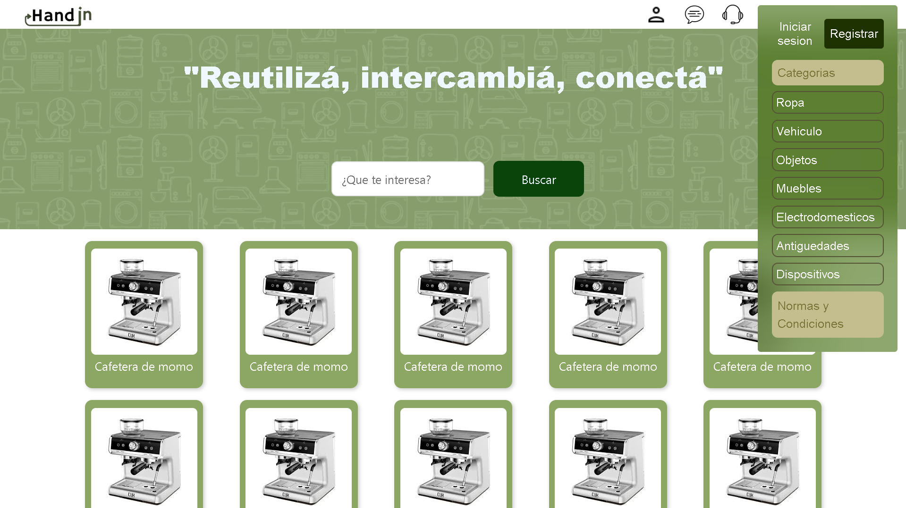
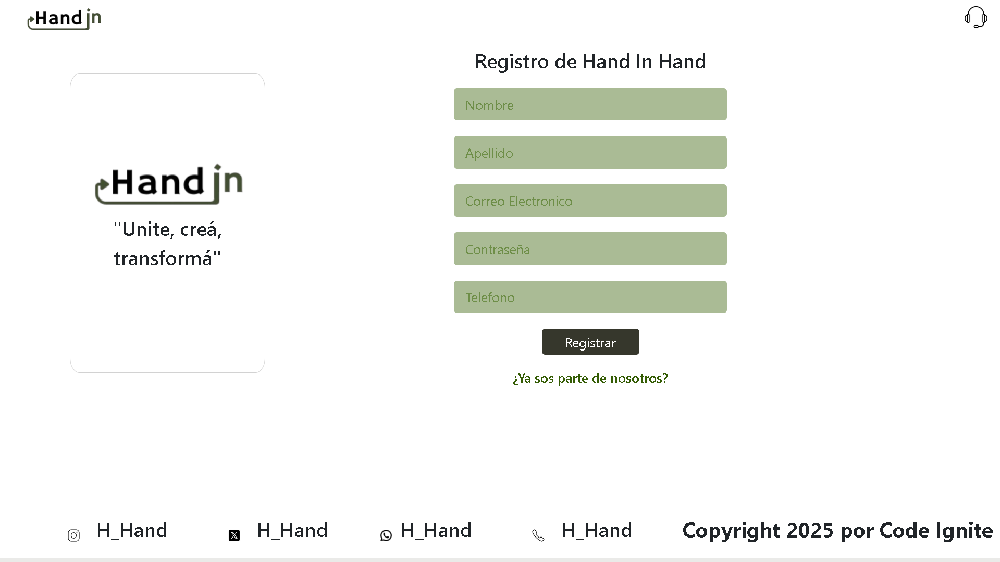

# HandinHand website

## Index
### 
### La página principal se compone de una sección menu la cual permite al usuario navegar por diferentes partes de la página con los botones de la parte derecha del header.
#### El primer icono pertenece a la parte del perfil de usuario, donde, si no está logueado, enviará al usuario al un formulario para registrarse ingresando datos correspondientes.
#### El segundo icono pertenece a al chat entre usuarios. Al clickear el botón se desplegará un menu donde el usuario tendrá acceso a chats con otros usuarios para realizar trueques. 
#### El tercer icono pertenece a la sección del soporte técnico, donde al clickear, el usuario tendrá acceso a un formlario donde podrá explicar su/s problema/s.
#### El último icono pertenece al menu desplegable de la página el cual, al darle click, se desplegará, mostrando un menú donde apareceran las siguientes opciónes en la parte superior.

## Index Sidebar
### 
### Al lado izquierdo se encuentra un botón que envía al usuario a iniciar sesión a traves de un formulario, mientras que a la derecha se encuentra un botón que envía al usuario a la página de registro. Luego, debajo tiene diferentes botónes para ayudar al usuario a filtrar productos según su preferencia, como por ejemplo, por categoría, ropa, vehículos, etc. Y finalmente , en la parte inferior, se encuentra un botón que envía al usuario a las normas y condiciones de la página

## Login
### 
### El login es un formulario corto el cual pide al usuario ingresar su nombre, apellido y contraseña para luego ingresar al index nuevamente. Además, en caso de que el usuario halla olvidado su contraseña. Tiene debajo del botón "Confirmar" un texto link el cual lo envía a otro formulario, el cual, ayudará al usuario a cambiar su contraseña.
## Register
### 
### El registrar es un formulario levemente más extenso que el del login, pidiendo al usuario su nombre, apellido, contraseña, correo electrónico y su número de telefono para registrarse. Además, debajo del botón "Registrar" se encuentra un texto link el cual envía al usuario al formulario de inicio de sesión.