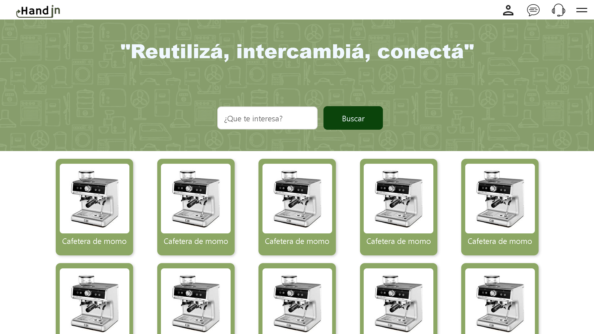
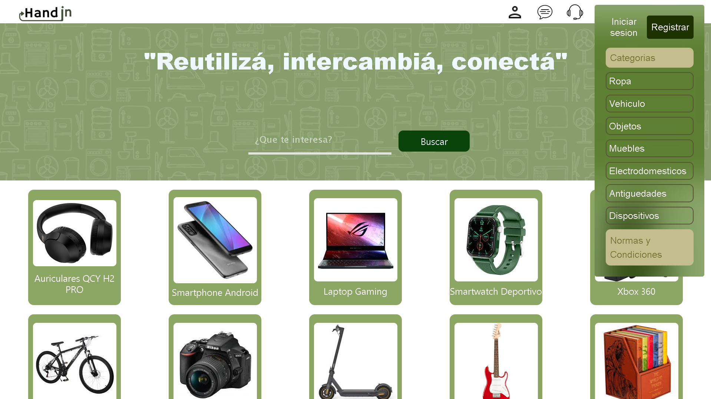
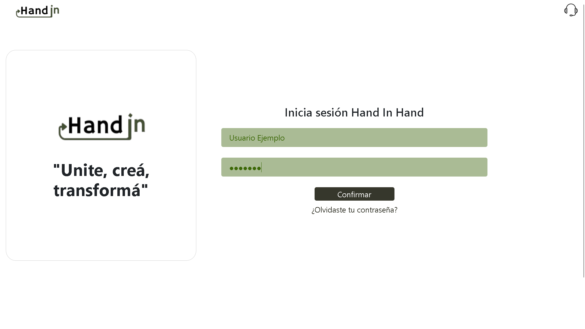
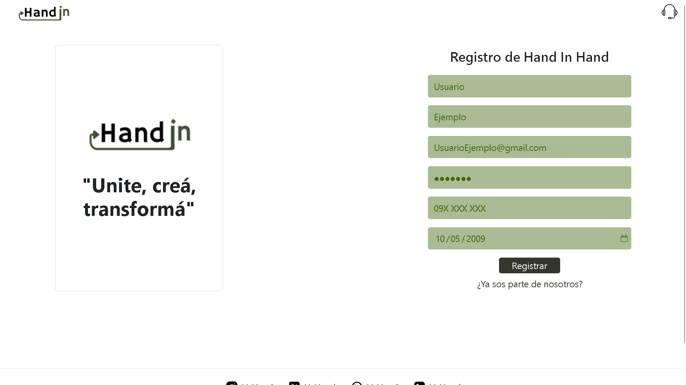

# HandinHand Frontend

<div align="center">
    
    <br>
    <b>"Reutilizá, intercambiá, conectá"</b>
    <br>
    Una plataforma web moderna para el intercambio y trueque de productos entre usuarios.
</div>

---

## 📋 Tabla de Contenidos

- [Descripción](#descripción)
- [Justificación del Diseño Visual](#justificación-del-diseño-visual)
- [Accesibilidad y Usabilidad](#accesibilidad-y-usabilidad)
- [Animaciones y Efectos](#animaciones-y-efectos)
- [Proceso de Desarrollo Visual](#proceso-de-desarrollo-visual)
- [Características](#características)
- [Estructura del Proyecto](#estructura-del-proyecto)
- [Tecnologías](#tecnologías)
- [Instalación](#instalación)
- [Uso](#uso)
- [Páginas](#páginas)
- [API Reference](#api-reference)
- [Screenshots](#screenshots)
- [Roadmap](#roadmap)
- [Contribuir](#contribuir)
- [Configuración de Desarrollo](#configuración-de-desarrollo)
- [Problemas Conocidos](#problemas-conocidos)
- [Performance](#performance)
- [Autores](#autores)
- [Licencia](#licencia)
- [Agradecimientos](#agradecimientos)

---

## 🚀 Descripción

**HandinHand** es una aplicación web frontend desarrollada para facilitar el intercambio de productos entre usuarios, promoviendo la reutilización y el consumo responsable. La plataforma ofrece una interfaz intuitiva y moderna para conectar personas que desean intercambiar sus pertenencias.

---

## 🎨 Justificación del Diseño Visual

El diseño visual de HandinHand fue cuidadosamente planificado para transmitir confianza, accesibilidad y modernidad:

- **Colores:**  
    Se eligió una paleta basada en tonos verdes y azules suaves, asociados a sostenibilidad y confianza. El color principal (#4CAF50) se utiliza para botones y elementos destacados, mientras que los fondos claros (#F9F9F9, #FFFFFF) facilitan la lectura y reducen la fatiga visual. Los colores secundarios y de acento aseguran contraste suficiente para la accesibilidad.

- **Tipografías:**  
    Se utiliza la fuente **'Roboto'**, una tipografía sans-serif moderna y legible, ideal para interfaces web. Los títulos emplean pesos más gruesos para jerarquía visual, y los textos de párrafo mantienen un tamaño mínimo de 16px para asegurar legibilidad.

- **Distribución:**  
    El layout es **mobile-first**, con una estructura de grilla flexible (CSS Grid y Flexbox) que adapta el contenido a cualquier dispositivo. El header fijo y el menú lateral mejoran la navegación, mientras que los espacios en blanco (white space) ayudan a separar visualmente las secciones.

- **Herramientas UX/UI:**  
    - **Figma:** Para wireframes y prototipos interactivos.
    - **Bootstrap 5:** Para componentes responsivos y consistentes.
    - **Coolors:** Para la definición de la paleta cromática.
    - **Google Fonts:** Para la integración de tipografías web.

---

## ♿ Accesibilidad y Usabilidad

El proyecto HandinHand incorpora buenas prácticas de accesibilidad y usabilidad para garantizar una experiencia inclusiva:

- **Etiquetas Semánticas:**  
    Uso de elementos HTML5 como `<header>`, `<nav>`, `<main>`, `<section>`, `<footer>`, `<form>`, y `<button>` para estructurar el contenido y facilitar la navegación por lectores de pantalla.

- **Contraste de Colores:**  
    Todos los textos y botones cumplen con los estándares de contraste WCAG AA, asegurando legibilidad para personas con baja visión.

- **Tamaños de Fuente y Espaciado:**  
    Fuentes mínimas de 16px, botones y campos de formulario con padding suficiente para ser fácilmente seleccionables en dispositivos táctiles.

- **Navegación Clara:**  
    Menú lateral accesible mediante teclado, foco visible en elementos interactivos, y rutas bien definidas. El logo siempre retorna a la página principal.

- **Formularios Accesibles:**  
    Etiquetas `<label>` asociadas a cada campo, mensajes de error descriptivos y validaciones en tiempo real.

- **Imágenes con Texto Alternativo:**  
    Todas las imágenes relevantes incluyen atributos `alt` descriptivos.

- **Animaciones No Intrusivas:**  
    Las animaciones son suaves y no afectan la comprensión del contenido.

---

## ✨ Animaciones y Efectos

Se implementaron animaciones y efectos para mejorar la experiencia de usuario sin distraer:

- **Transiciones CSS:**  
    - Efectos hover en botones y tarjetas de productos (`transition: all 0.3s ease`).
    - Menú lateral con animación de deslizamiento (`transform: translateX`).
    - Aparición progresiva de productos al cargar la página.

- **Animaciones JavaScript:**  
    - Feedback visual en formularios (campos válidos/erróneos).
    - Mensajes de éxito/error con fade in/out.

- **Animaciones Responsivas:**  
    - Adaptación de animaciones según el dispositivo para mantener la fluidez.

---

## 🖌️ Proceso de Desarrollo Visual

El desarrollo visual siguió una metodología iterativa:

1. **Wireframes:**  
     Se crearon bocetos en Figma para definir la estructura básica de cada página (inicio, login, registro, soporte, perfil).

2. **Prototipos:**  
     Se desarrollaron prototipos interactivos en Figma para validar la navegación y disposición de elementos antes de codificar.

3. **Implementación:**  
     - Se trasladó el diseño a HTML5 y CSS3, utilizando Bootstrap para la grilla y componentes.
     - Se ajustaron los estilos para cumplir con los criterios de accesibilidad y responsive design.

4. **Iteración y Testing:**  
     - Se realizaron pruebas de usabilidad con usuarios reales y ajustes según feedback.
     - Se validó el contraste de colores y la navegación por teclado.

**Ejemplo de wireframe (Figma):**  


---

## ✨ Características

### 🎯 Funcionalidades Principales

- **Catálogo de Productos:** Visualización dinámica de productos disponibles para intercambio.
- **Sistema de Usuarios:** Registro e inicio de sesión completo.
- **Navegación Intuitiva:** Header con iconos y menú lateral desplegable.
- **Búsqueda:** Barra de búsqueda integrada (UI implementada).
- **Responsive Design:** Totalmente adaptable a dispositivos móviles y desktop.

### 🔧 Características Técnicas

- **Diseño Responsivo:** Mobile-first con breakpoints optimizados.
- **Validación de Formularios:** Validación client-side completa.
- **LocalStorage:** Persistencia de datos de usuario.
- **Animaciones CSS:** Transiciones suaves y efectos hover.
- **Grid Layout:** Sistema de grillas adaptable para productos.

---

## 🗂️ Estructura del Proyecto

```
HandinHand/
├── .vscode/
│   └── settings.json           # Configuración del editor
├── css/
│   └── style.css              # Estilos principales
├── js/
│   ├── script.js              # Lógica principal y productos
│   ├── sidebar.js             # Funcionalidad del menú lateral
│   ├── login.js               # Gestión de inicio de sesión
│   └── register.js            # Gestión de registro
├── img/                       # Recursos gráficos
│   ├── Hand(sinfondo).png     # Logo principal
│   ├── user-icon.png          # Iconos de interfaz
│   └── ...                    # Imágenes de productos
├── index.html                 # Página principal
├── login.html                 # Página de inicio de sesión
├── register.html              # Página de registro
├── support.html               # Página de soporte
├── user.html                  # Página de perfil de usuario
└── README.md                  # Este archivo
```

---

## 🛠 Tecnologías

- **HTML5** - Estructura semántica
- **CSS3** - Estilos, Flexbox, Grid, Animaciones
- **JavaScript ES6+** - Lógica de aplicación
- **Bootstrap 5.3.7** - Framework CSS (CDN)
- **LocalStorage API** - Persistencia de datos

---

## 📦 Instalación

### Prerequisitos

- Navegador web moderno
- Servidor web local (opcional)

### Pasos de Instalación

1. Clonar el repositorio

     ```bash
     git clone https://github.com/tu-usuario/handinhand-frontend.git
     cd handinhand-frontend
     ```

2. Abrir con Live Server (opcional)

     ```bash
     # Si tienes Live Server instalado
     live-server
     ```

3. O abrir directamente

     - Abrir `index.html` en tu navegador  
     - Para mejor funcionalidad, usar un servidor local

---

## 🎮 Uso

### Navegación Principal

- **Logo:** Click para volver al inicio
- **Usuario:** Acceso a registro/perfil
- **Chat:** Comunicación entre usuarios (próximamente)
- **Soporte:** Centro de ayuda
- **Menú:** Navegación completa y filtros

### Registro de Usuario

- Click en el icono de usuario
- Completar formulario de registro
- Validación automática de edad (+18)
- Redirección automática al login

### Inicio de Sesión

- Usuario de prueba: `Angel` / `12345`
- Integración con usuarios registrados

---

## 📱 Páginas

### 🏠 index.html - Página Principal

- Header con navegación
- Barra de búsqueda destacada
- Grid de productos dinámico
- Menú lateral con categorías
- Footer con redes sociales

### 🔐 login.html - Inicio de Sesión

- Formulario de autenticación
- Validación de campos
- Manejo de errores
- Enlace de recuperación

### 📝 register.html - Registro

- Formulario completo de registro
- Validaciones client-side
- Verificación de mayoría de edad
- Prevención de emails duplicados

### 🆘 support.html - Soporte

- Estructura básica implementada
- Próximas funcionalidades de soporte

---

## 🔌 API Reference

### LocalStorage Schema

```js
// Usuarios Registrados
{
    "registeredUsers": [
        {
            "username": "email@example.com",
            "password": "password123",
            "name": "Nombre",
            "surname": "Apellido",
            "phone": "123456789",
            "birthdate": "1990-01-01"
        }
    ]
}
```

### Productos Predefinidos

```js
const products = [
    {
        img: 'img/producto.jpg',
        title: "Nombre del Producto",
        description: "Descripción detallada..."
    }
];
```

---

## 📸 Screenshots

<details>
    <summary>Ver capturas de pantalla</summary>

    **Página Principal**  
    

    **Menu Lateral**  
    

    **Login**  
    

    **Registro**  
    

</details>

### Responsive Breakpoints

- Desktop: > 1200px - 5 columnas
- Tablet: 900px - 1200px - 3 columnas
- Mobile Large: 600px - 900px - 2 columnas
- Mobile: < 600px - 1 columna

---

## 🗺 Roadmap

### ✅ Completado

- Interfaz responsive
- Sistema de registro/login
- Catálogo de productos
- Navegación funcional
- Validaciones de formularios

### 🚧 En Progreso

- Sistema de chat entre usuarios
- Funcionalidad de búsqueda
- Filtros por categoría
- Página de perfil de usuario

### 📋 Futuras Funcionalidades

- Subida de imágenes de productos
- Sistema de ratings/reviews
- Notificaciones push
- Geolocalización para intercambios locales
- Integración con redes sociales
- Dashboard de administración

---

## 👥 Contribuir

### Proceso de Contribución

1. Fork el proyecto
2. Crear una rama feature  
     ```bash
     git checkout -b feature/AmazingFeature
     ```
3. Commit los cambios  
     ```bash
     git commit -m 'Add some AmazingFeature'
     ```
4. Push a la rama  
     ```bash
     git push origin feature/AmazingFeature
     ```
5. Abrir un Pull Request

### Estándares de Código

- **HTML:** Semántico y accesible
- **CSS:** BEM methodology preferida
- **JavaScript:** ES6+ con comentarios descriptivos
- **Commits:** Conventional commits

### Reportar Bugs

Usar el sistema de Issues con el template:

```
**Descripción del Bug**
Descripción clara del problema

**Pasos para Reproducir**
1. Ir a '...'
2. Click en '....'
3. Ver error

**Comportamiento Esperado**
Descripción de lo que debería pasar

**Screenshots**
Si aplica, agregar screenshots
```

---

## 🔧 Configuración de Desarrollo

### VSCode Settings

```json
{
        "clock.active": true,
        "liveServer.settings.port": 5501
}
```

### Extensiones Recomendadas

- Live Server
- Prettier
- Auto Rename Tag
- CSS Peek

---

## 🚨 Problemas Conocidos

- Contraseñas almacenadas en texto plano
- Falta validación de formato de email
- Botón de chat no funcional
- Página de soporte incompleta

---

## 📊 Performance

- Lighthouse Score: 90+ (Performance)
- Responsive: 100% compatible
- Browser Support: Chrome 70+, Firefox 65+, Safari 12+

---

## 👨‍💻 Autores

- Code Ignite Team - Desarrollo inicial

---

## 📄 Licencia

Este proyecto está bajo la Licencia MIT - ver el archivo LICENSE.md para detalles.

---

## 🙏 Agradecimientos

- Bootstrap team por el framework CSS
- Comunidad de desarrolladores web
- Beta testers y usuarios

<div align="center">
    <p>Hecho con ❤️ por Code Ignite</p>
</div>
